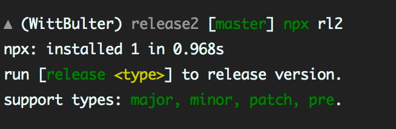

## rl2, release v2

[release](https://github.com/zeit/release) is a great library, but it doesn't seem to be updated at the moment. **release2** solved some of the legacy issues.

<br/>

### features

- Hooks are always available.
- No dependencies. (40k ~gzip).
- Support multiple remotes.
- Faster running speed.

<br/>

### usage

release2 will help you automatically generate a release, follow [SemVer](https://semver.org/) spec.

- **download**: `npm i -g rl2`

- **release**: `rl patch`

<br/>

- support release type:

`rl major`: incompatible API change.

`rl minor`: backwards-compatible functionality.

`rl patch`: backwards-compatible bug fix.

`rl pre`: pre-release.

`rl pre <type>`: custom pre-release.


<br/>

### use with npx

> required npm > 5.2.0
[what is `npx`](https://blog.npmjs.org/post/162869356040/introducing-npx-an-npm-package-runner).

```bash
npx rl2 <type>
```

**installation time is less than 1 sec by npx.**
&nbsp;&nbsp;

<br/>

### hooks

`rl2` will look for a file named `release.js` in the root directory of your project.

```js
// release.js
module.export = (meta: Release.HookMetas): string => {
  if (meta.type === 'patch') {
    return 'fix some bugs'
  }
  return meta.version
}
```

**Hook params**:

```ts
export interface ChangeInfo {
  name: string,
  pluralName: string,
  description: string,
}

export interface HookMetas {
  infos: ChangeInfo,
  type: string,
  version: string,
}
```

<br/>

### license
[MIT](LICENSE)


